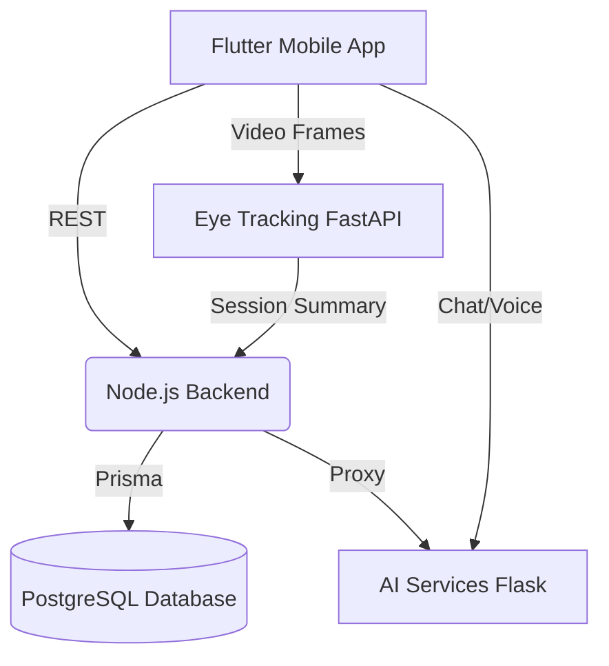

# Autimate

Autimate is a comprehensive ecosystem designed to support individuals with Autism Spectrum Disorder (ASD), their caregivers, and family members. It features a Flutter-based mobile application for both children and parents, a Node.js API backend, an AI service providing autism prediction screening and a specialized conversational chatbot, and a computer-vision eye-tracking service for analyzing attention and engagement.

> **Disclaimer**: The survey model is a screening aid trained on a public dataset and is **NOT** a medical diagnosis. Always consult a healthcare professional for clinical diagnoses.

## Features
- **Child Interface**: Engaging learning modules, routine management, games, and an AI companion chatbot.
- **Parent Interface**: Dashboards tracking child progress, AI-driven behavioral analysis reports, community interaction, and educational articles.
- **AI Services**: Predictive screening via a Random Forest model, and a compassionate, autism-specialized LLM chatbot using Gemini and Groq TTS/STT.
- **Eye-Tracking**: Real-time MediaPipe-based behavioral analysis determining distraction and engagement during activities.

## Architecture



## Tech Stack
| Component | Technology |
| --- | --- |
| Mobile App | Flutter, Dart |
| Backend API | Node.js (20), Express, TypeScript, Prisma |
| Database | PostgreSQL (15) |
| AI Services | Python, Flask, Scikit-learn, Google Gemini, Groq |
| Eye-Tracking | Python, FastAPI, OpenCV, MediaPipe |
| Infrastructure | Docker, Docker Compose, GitHub Actions |

## Prerequisites
- [Docker](https://docs.docker.com/get-docker/) and Docker Compose
- [Flutter SDK](https://docs.flutter.dev/get-started/install) (for local mobile development)

## Quick Start
Get the entire backend stack running locally with just a few commands:

1. **Clone and setup environment**:
   ```bash
   git clone <your-repo-url>
   cd autimate
   cp .env.example .env
   ```
2. **Configure Secrets**:
   Edit `.env` and add your keys (you can get keys from [Google AI Studio](https://aistudio.google.com/) and [Groq Console](https://console.groq.com/)).
3. **Start the services**:
   ```bash
   make up
   ```
4. **Seed the database (Optional)**:
   ```bash
   make seed
   ```

## Services & Ports
| Service | Port | Local URL |
| --- | --- | --- |
| PostgreSQL DB | `5432` | `localhost:5432` |
| Node.js Backend | `4000` | `http://localhost:4000` |
| AI Services | `5000` | `http://localhost:5000` |
| Eye-Tracking | `8000` | `http://localhost:8000` |

### Quick Tests
- Backend Health: `curl http://localhost:4000/health`
- AI Services Health: `curl http://localhost:5000/health`
- Eye-Tracking Health: `curl http://localhost:8000/`

## Running the Mobile App
To run the Flutter app locally (e.g., on an Android emulator):

1. **Navigate to the mobile directory**:
   ```bash
   cd mobile
   ```
2. **Install dependencies**:
   ```bash
   flutter pub get
   ```
3. **Run the app**:
   ```bash
   # For Android Emulator
   flutter run --dart-define=API_BASE_URL=http://10.0.2.2:4000 --dart-define=EYE_TRACKING_URL=http://10.0.2.2:8000
   
   # For Physical Device (replace with your computer's local IP)
   flutter run --dart-define=API_BASE_URL=http://192.168.1.x:4000 --dart-define=EYE_TRACKING_URL=http://192.168.1.x:8000
   ```
   *Note: Ensure camera and microphone permissions are granted on the device for the eye-tracking and voice chatbot to work.*

## Troubleshooting & Operations
- **Reset Database**: `make reset` (WARNING: Wipes all data)
- **View Logs**: `make logs`
- **Ports busy**: Ensure you don't have local instances of Postgres, Node, or Python running on the used ports.
- **MediaPipe Errors**: Make sure the container has access to sufficient memory. 

## Folder Structure
```
autimate/
├── ai-services/    # Python Flask API for chatbot, TTS, STT, and survey predictions
├── backend/        # Node.js REST API with Prisma ORM
├── docs/           # Documentation and architecture diagrams
├── eye-tracking/   # Python FastAPI service for facial landmark tracking
└── mobile/         # Flutter application codebase
```
